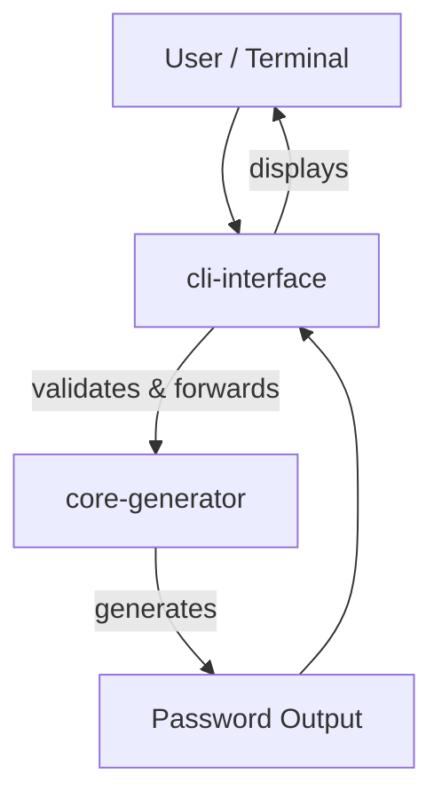
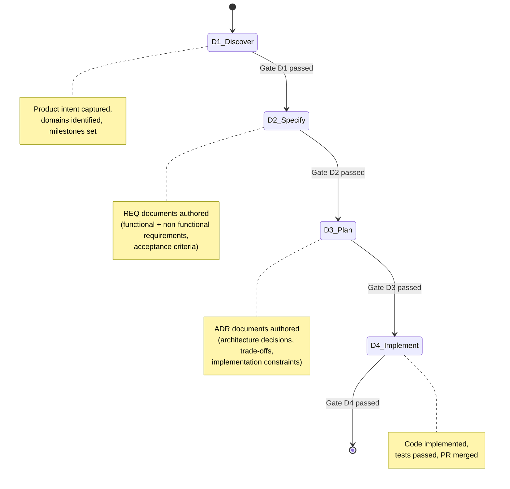
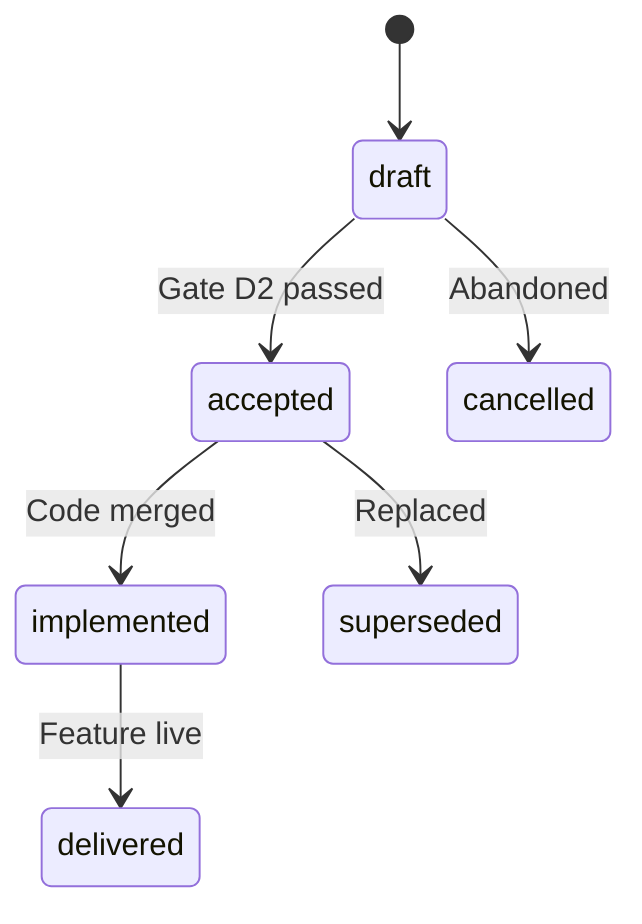

# CLI Password Generator — AGENTS

## 1. Service Overview

A command-line tool that generates secure, customizable passwords based on user-defined length and character set constraints.
The system is composed of two services:

| Service | Description | Stack |
|---|---|---|
| `cli-interface` | CLI argument parsing, flag configuration, user input handling, and output | Python / Argparse |
| `core-generator` | Pure password generation logic, character sets, randomization, entropy validation | Python (stdlib) |

### System Context Diagram



## 2. Spec Driven Development Methodology

This repository follows the Spec Driven Development (SDD) lifecycle with four mandatory phase gates:



### Phase Gate Definitions

| Gate | Phase | Outcome | Owner |
|---|---|---|---|
| D1 | Discover | Product intent documented, domains identified | PM / Architect |
| D2 | Specify | REQ documents in `accepted` status | Architect |
| D3 | Plan | ADR documents in `accepted` status | Architect |
| D4 | Implement | Code merged, tests passing, delivered | Coder / Operator |

### REQ Status Lifecycle

REQ documents follow this state machine:



**Status Transition Blocker:** No REQ or ADR with status `draft` or `proposed` may advance beyond its current phase. Transition to `accepted` requires zero `TBD`, `TO-DO`, or `[to be defined]` markers in the document body.

## 3. Hardware Topology & Causal Disentanglement

Execution is distributed across two hardware nodes with strict privilege separation:

```mermaid
graph TB
    subgraph Node_A ["Node A — RTX 3090 (24 GB)"]
        direction TB
        ARCH[@architect]
        CODER[@coder]
        PROMPT[@promptmind]
        OP[@operator]
    end

    subgraph Node_B ["Node B — RTX 3060 (12 GB)"]
        COMP[companion orchestrator]
    end

    COMP -->|routes tasks| ARCH
    COMP -->|routes tasks| CODER
    COMP -->|routes tasks| PROMPT
    COMP -->|routes tasks| OP

    style COMP fill:#0077cc,color:#fff
    style ARCH fill:#ff8c00,color:#fff
    style CODER fill:#228b22,color:#fff
    style PROMPT fill:#9932cc,color:#fff
    style OP fill:#4682b4,color:#fff
```

### Agent Role Boundaries

| Agent | Node | Phase Responsibility | Causal Authority | Forbidden Actions |
|---|---|---|---|---|
| `@architect` | A | Specify + Plan | REQs, ADRs, Mermaid, YAML frontmatter | Application code syntax, git operations, orchestration |
| `@coder` | A | Implement | Python code, test suites, scripts | REQ/ADR authoring, git operations without delegation |
| `@promptmind` | A | Pre-execution | Prompt refinement using research-backed techniques | Code execution, orchestration |
| `@operator` | A | Repo ops | Git, GitHub actions, CI, chore execution | Code authoring, spec authoring |
| `@companion` | B | Orchestration | D1-D4 pipeline gates, agent routing, schema enforcement | Direct code authoring |

### Blocking Rules

1. **Status Transition Blocker:** Do not advance to the next SDD phase if the current document status is `draft` or `proposed`.
2. **Cognitive State Blocker:** `@architect` SHALL NOT emit application syntax. Any request requiring software implementation logic SHALL be routed to `@coder`.
3. **Lateral Delegation Ban:** Execution agents (Node A) SHALL NOT invoke other agents, spin up sub-tasks, or load orchestration toolsets. When a task falls outside the agent's causal boundary, halt immediately and emit:

   `[DEPENDENCY_YIELD: Requires @<target_agent> for <specific_task>]`

   Control returns to `@companion` (Node B) for routing.

## 4. Technology Stack

| Technology | Version | Service | Notes |
|---|---|---|---|
| Python 3.x | Latest stable | Both | Runtime |
| Argparse | stdlib | cli-interface | CLI argument parsing |
| secrets / random | stdlib | core-generator | Cryptographically secure generation |
| pytest | Latest stable | Both | Test framework |

Refer to [`docs/shared/architecture/tech-stack.md`](docs/shared/architecture/tech-stack.md) for the canonical, versioned stack table.

## 5. Business Domains & REQ Organization

Requirements are scoped into three business domains. Each domain has a dedicated index file in `docs/shared/requirements/`.

| Domain | Scope | Index File |
|---|---|---|
| `cli-arguments` | Command-line parsing, flag configuration, user input handling | [`index-cli-arguments.md`](docs/shared/requirements/index-cli-arguments.md) |
| `password-logic` | Password generation rules, character sets, randomization | [`index-password-logic.md`](docs/shared/requirements/index-password-logic.md) |
| `security-validation` | Entropy checks, exclusion rules, constraint validation | [`index-security-validation.md`](docs/shared/requirements/index-security-validation.md) |

### REQ Naming & Structuring

- File naming: `REQ-NNN-<kebab-case-title>.md`
- H1 heading: `# REQ-NNN — Title` (em-dash separator)
- Functional requirements use `REQ-F-NNN` IDs
- Acceptance criteria use `### AC-NNN — Descriptive title`
- RFC 2119 keywords SHALL be capitalised: `SHALL`, `SHOULD`, `MAY`

Refer to [`docs/shared/requirements/guidelines.md`](docs/shared/requirements/guidelines.md) for the full REQ authoring specification.
Refer to [`docs/shared/requirements/000-template.md`](docs/shared/requirements/000-template.md) for the REQ template.

### ADR Organization

Architecture Decision Records follow the MADR (Minimal ADR) format:

| ADR Field | Purpose |
|---|---|
| `id` | Globally unique, zero-padded integer |
| `title` | Matches H1 heading exactly |
| `status` | `draft`, `proposed`, `accepted`, `superseded`, `deprecated` |
| `decided` | Decision date |
| `context` | Problem statement and constraints |
| `decision` | The architectural choice made |
| `consequences` | Positive, negative, and neutral outcomes |

Refer to [`docs/shared/architecture/adrs/`](docs/shared/architecture/adrs/) for the ADR registry.

## 6. Service Architecture & Boundaries

```mermaid
componentDiagram
    package cli-interface {
        [CLI Parser] -- parses -- [Arguments]
        [Arguments] -- validates -- [Options]
        [Options] -- forwards -- [Generator Request]
    }

    package core-generator {
        [Generator Engine] -- receives -- [Generator Request]
        [Generator Engine] -- applies -- [Character Set Rules]
        [Generator Engine] -- validates -- [Entropy Check]
        [Generator Engine] -- produces -- [Password]
    }

    [CLI Parser] -- depends on -- [Generator Engine]
```

### Boundary Rules

- **cli-interface** owns all user-facing interaction: argument parsing, flag validation, error messaging, and output formatting. It SHALL NOT contain password generation logic.
- **core-generator** owns all password generation logic: character set selection, randomization, entropy validation. It SHALL NOT depend on CLI libraries or terminal I/O.
- Cross-service calls flow in one direction: `cli-interface` delegates to `core-generator`. No reverse dependency is permitted.

## 7. Source Control & Release Management

### Branching Strategy

**Trunk-based development.** The `main` branch is the single source of truth. Short-lived feature branches are created per REQ or ADR and merged via Pull Request.

### Commit Messages

Conventional Commits SHALL be used. Valid prefixes:

| Prefix | Meaning |
|---|---|
| `feat:` | New feature or requirement implementation |
| `fix:` | Bug fix |
| `docs:` | Documentation changes (REQ, ADR, AGENTS) |
| `style:` | Formatting, no logic change |
| `refactor:` | Code restructuring, no behavioural change |
| `test:` | Test additions or modifications |
| `chore:` | Maintenance, dependencies, CI |

### Pull Request Checklist

1. Branch follows strategy conventions
2. Code/docs satisfy an `accepted` REQ or ADR
3. All tests (derived from ACs) pass locally
4. PR description includes:
   - Summary of changes and rationale
   - Key technical modifications
   - Related REQ-NNN or ADR-NNN reference
5. Human code review and CI pipeline clearance

### Milestones

| Milestone | Meaning |
|---|---|
| `mvp` | Core password generation with basic alphanumeric customization |
| `v2` | Special characters, exclusion rules, CLI flags, entropy validation |

Refer to [`docs/shared/architecture/scm.md`](docs/shared/architecture/scm.md) for full SCM policy.

## 8. Companion-First Agency Model

The `@companion` orchestrator (Node B) governs all task routing and pipeline enforcement:

| Mode | Description | When to Use |
|---|---|---|
| **Automation** | Agent executes fully autonomously | Well-defined tasks with clear acceptance criteria |
| **Augmentation** | Agent assists, human validates | Ambiguous requirements, exploratory tasks |
| **Agency** | Agent proposes options, human decides | Architectural trade-offs, prioritization decisions |

### Pipeline Enforcement

`@companion` enforces schema conformance at every D1-D4 gate:

- Validates REQ/ADR frontmatter fields before accepting submissions
- Forces MADR format compliance on ADR documents
- Verifies REQ index file integrity across domain updates
- Blocks phase transitions when documents contain unresolved markers

## 9. Coding Conventions

- Python code SHALL follow PEP 8 styling
- Type hints SHALL be applied to all function signatures
- Docstrings SHALL follow Google-style convention
- Cryptographic operations SHALL use the `secrets` module, never `random` for password generation
- Error handling SHALL produce actionable exit codes and human-readable messages

## 10. Quality & Deployment Rules

### Quality Gates

| Gate | Requirement |
|---|---|
| Test Coverage | All Acceptance Criteria SHALL have corresponding pytest tests |
| Lint | Code SHALL pass flake8 / pylint checks before PR submission |
| Static Analysis | Type checking SHALL pass (mypy equivalent) |
| CI Pipeline | All gates pass before merge to `main` |

### Deployment

As a CLI tool, deployment consists of packaging and distribution via standard Python packaging mechanisms. Refer to each service's module-level documentation for build and packaging commands.

## 11. Required References

All agents SHALL consult these shared documents:

| Reference | Purpose |
|---|---|
| [`docs/shared/architecture/`](docs/shared/architecture/) | Architecture overview, tech stack, glossary, SCM policy, ADR registry |
| [`docs/shared/requirements/`](docs/shared/requirements/) | REQ authoring guidelines, templates, domain index files |
| [`docs/shared/architecture/overview.md`](docs/shared/architecture/overview.md) | System context, service inventory |
| [`docs/shared/architecture/scm.md`](docs/shared/architecture/scm.md) | Branching strategy, PR process, commit conventions |
| [`docs/shared/requirements/guidelines.md`](docs/shared/requirements/guidelines.md) | REQ structure, naming, status lifecycle, PR checklist |

## 12. Agent & Skill Discovery

Execution agents (`@coder`, `@architect`, `@operator`) MUST NOT autonomously scan or load directories containing orchestration logic.

- Agents are strictly forbidden from globbing or reading files inside `.opencode/skills/`.
- Agents may only consult technical agent definitions in `.opencode/agents` or `.claude/agents`.

### Available Skills

| Skill | Trigger | Description |
|---|---|---|
| `companion` | Pipeline orchestration | Hub-and-spoke process orchestrator for SDD methodology |
| `doc-review` | `/doc-review [file-path]` | Reviews REQ/ADR against authoring guidelines |
| `implementer` | REQ accepted + ADRs accepted | Full implementation lifecycle (BDD+TDD, Sec+QA+CR, PR) |
| `promptmind` | Prompt refinement | Rewrites prompts using peer-reviewed prompt engineering |
| `req-to-figma-make` | Figma Make conversion | Converts REQ/PRD into TC-EBC prompts for Figma Make |
| `tdd` | Test-first development | TDD guidelines for feature/bug implementation |

## 13. Progressive Disclosure Policy

- **Root file (`AGENTS.md`):** Universal context — business context, SDD methodology, hardware topology, agent boundaries, quality gates, shared references.
- **Module/service files:** Technical and implementation-specific details — framework commands, build scripts, test commands, linting configuration.
- Do NOT duplicate build, test, or deploy instructions in this root file when the official source already exists in a service module file.