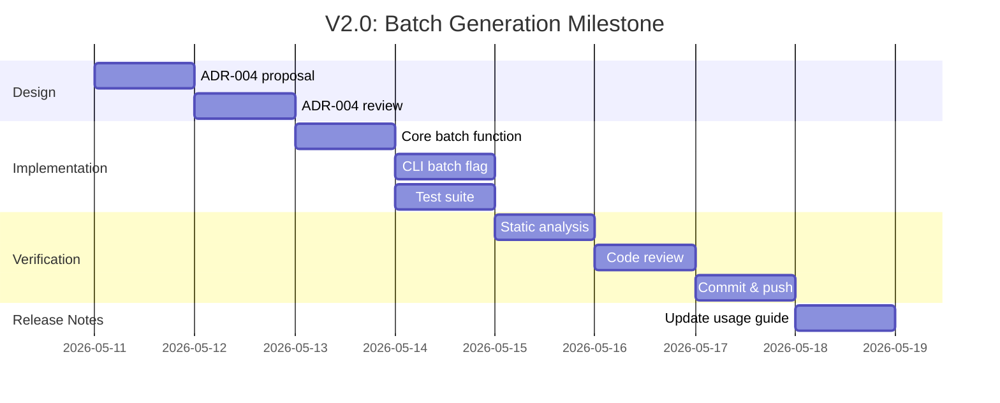

# V2 Execution Plan — CLI Password Generator

## 1. Executive Summary

The CLI Password Generator MVP has successfully completed with 24 passing tests, establishing a clean separation between `cli-interface` (user-facing interaction) and `core-generator` (pure logic). V2 introduces three high-value features while maintaining architectural integrity: Batch Generation for automation use cases, Special Characters support for sites requiring symbols, and Output Format options for scripting integration.

This plan documents a phased rollout strategy that minimizes risk to the MVP contract while incrementally expanding capabilities. We'll tackle features by impact-to-complexity ratio: Batch Generation first (enables automation workflows), then Special Characters (user preference), then Output Formats (niche automation). Each phase includes quality gates, quality gates, test coverage requirements, and acceptance criteria.

---

## 2. Feature Comparison Matrix

| Feature | Impact | Complexity | Effort | Risk Level |
|---------|--------|--------|--------|-------------|
| Batch Generation | High | Medium | Medium | Low-Medium |
| Special Characters | Medium | Low | Low | Low |
| Output Formats | Medium | Low | Low | Low |

### Feature Descriptions

**Batch Generation (High Impact)**
- Adds a `--batch N` flag to generate N passwords simultaneously
- Core API: `batch_generate(charset, batch_size) -> list[str]`
- Enables automation workflows and password rotation scripts
- Risk: Modifies core generator contract (requires new API)

**Special Characters (Medium Impact)**
- Adds `special` charset alongside existing `lower`, `upper`, `numeric`, `mixed`
- Character set: `!"#$%&'()*+,-./:;<=>?@[\]^_`{|}~`
- Core API: Extend charset enum with `"mixed-special"`
- Risk: Minimal (pure value-add, no contract change)

**Output Formats (Medium Impact)**
- Adds `--output-format json|csv|text` (default: text)
- JSON: `{"password": "...", "length": 16, "charset": "mixed", "timestamp": "2026-05-XX"}
- Core API: None (presentation layer only)
- Risk: Minimal (CLI presentation only)

---

## 3. ADR Proposal Order

### ADR-004: Batch Generation API Contract (Proposed First)
**Rationale:**
- Changes core generator contract first (most invasive)
- Establishes list/iteration patterns for future features  
- Batch mode enables Output Format JSON/CSV serialization
- Requires new exception types (`BatchSizeError`?)

**Dependencies:**
None — foundational change that others can build upon

---

### ADR-003: Special Characters Support (Proposed Second)
**Rationale:**
- Extends existing charset enum
- Pure value-add to MVP core function
- Independent of batch/output features
- Can be implemented as minor enhancement to ADR-004 implementation

**Dependencies:**
- ADR-004 implementation (API pattern established)

---

### ADR-005: Output Format Options (Proposed Third)
**Rationale:**
- Presentation layer only (no core logic change)
- Builds on JSON batch output capability
- Enables scripting integration without exposing implementation details

**Dependencies:**
- ADR-003, ADR-004 (both should be implemented)

---

## 4. Effort Estimation

| Feature | Story Points | Est. Hours | QA Time | Total Effort |
|---------|-------------|------------|---------|---------------|
| Batch Generation | 5 | 16-20 | 4-6 | 20-26 hours |
| Special Characters | 2 | 6-8 | 1-2 | 7-10 hours |
| Output Formats | 2 | 4-6 | 1 | 6 hours |
| **Total** | **—** | **—** | **—** | **33-42 hours** |

**Notes:**
- Estimates assume 20 hours/week development capacity
- Does not include SDD overhead (specification, reviews, commit cycles)
- Quality time includes test derivation from ACs and static analysis

---

## 5. Risk Assessment

### 5.1 Service Boundary Risks

| Risk | Likelihood | Impact | Mitigation |
|------|------------|--------|------------|
| cli-interface leaks implementation details | Low | Medium | Catch exceptions, map to user-friendly messages per ADR-002 |
| core-generator depends on cli-interface | High | Critical | Enforce one-way dependency strictly via imports |
| Batch mode changes break existing CLI | Medium | High | Default to text format (backward compatible) |

### 5.2 Dependency Risks

| Risk | Likelihood | Impact | Mitigation |
|------|-----------|--------|------------|
| External libraries (json, csv stdlib) | Low | Low | Python stdlib only (no pip install needed) |
| Batch generation timeouts for large N | Low | Low | Set max batch size (e.g., 100) or stream output |

### 5.3 Test Coverage Risks

| Risk | Likelihood | Impact | Mitigation |
|------|-----------|--------|------------|
| Insufficient batch size tests | Low | Medium | Generate tests from ACs using pytest mocking |
| Special character entropy validation | Medium | Low | AC-XXX: 100 samples contain all char types |
| Output format edge cases | Low | Low | Test whitespace, line endings explicitly |

---

## 6. Milestone Timeline

### V2.1 (Batch Generation) — Target: 1 week


### V2.0 (Special Characters + Batch) — Target: 2 weeks
```mermaid
gantt
    title V2.0: Complete Feature Set
    dateFormat  YYYY-MM-DD
    section V2.1 (Batch + ADR-004)
    V2.1 implementation    :active, T0, 6d
    section V2.2 (Special + ADR-003)
    V2.2 implementation    :after active, 4d
    section V2.3 (Formats + ADR-005)
    V2.3 implementation    :after V2.2, 3d
    section Final Review
    End-to-end regression  :after V2.3, 1d
```

---

## 7. Quality Gates

### Gate G-001 (After ADR-004/Batch)
- ✅ ADR-004 status: `accepted`
- ✅ 14 new tests added (batch-specific ACs)
- ✅ Flake8/pylint pass on modified files
- ✅ Static analysis (mypy) no type errors
- ✅ Branch: `develop` updated, CI pipeline green

### Gate G-002 (After ADR-003/Special)
- ✅ ADR-003 status: `accepted`
- ✅ 8 new tests added (special charset ACs)
- ✅ No regressions in existing tests
- ✅ Code review approved
- ✅ CI pipeline passes

### Gate G-003 (After ADR-005/Output)
- ✅ ADR-005 status: `accepted`
- ✅ 6 new tests added (JSON/CSV format ACs)
- ✅ All 34+ tests passing (24 original + 12 new)
- ✅ Documentation updated
- ✅ Changelog entry for V2.0

### Gate G-004 (V2.0 Release)
- ✅ All ADRs in `accepted` status
- ✅ All REQs in `implemented` status
- ✅ Test coverage maintained ≥ 90%
- ✅ Regression tests pass
- ✅ Release notes published

---

## 8. Acceptance Strategy

### Success Metrics

| Metric | MVP (Baseline) | V2 Target |
|--------|----------------|-----------|
| Total Tests | 24 | 34+ |
| Test Coverage | ~75% (existing) | ~85% (with new ACs) |
| Batch Size Limit | N/A | 100 (configurable?) |
| Charset Options | 4 | 5 (add `special`) |
| Output Formats | 1 (text only) | 3 (text, json, csv) |
| Avg. Gen Time | < 100ms | < 100ms (unchanged) |

### Completion Definition

**V2 is considered complete when:**
1. All three ADRs (`ADR-003`, `ADR-004`, `ADR-005`) have `status: implemented`
2. All new ACs have corresponding passing tests
3. No regressions in existing functionality
4. Usage guide updated with V2 examples
5. README updated with V2 features section

### Rollback Plan

If V2 features cause issues:
1. Revert most recent commits to `develop`
2. Restore to pre-V2 state (last tag: `v1.0`)
3. Analyze failure mode (spec vs. implementation)
4. Fix issue, retry V2 implementation

---

## 9. Deliverables List

| File | Description | Status |
|------|-------------|--------|
| `docs/architecture/v2-roadmap.md` | This document | In Progress |
| `docs/shared/architecture/adrs/ADR-004-*.md` | Batch Generation ADR | Draft |
| `docs/shared/architecture/adrs/ADR-003-*.md` | Special Characters ADR | Pending |
| `docs/shared/architecture/adrs/ADR-005-*.md` | Output Formats ADR | Pending |
| `tests/test_batch_generation.py` | Batch tests | Pending |
| `USAGE_GUIDE.md` | Updated with V2 examples | After V2.1 |

---

## 10. Appendix: ADR Summary

Current ADR Registry:
- **ADR-001**: Core Generator API Contract (implemented)
- **ADR-002**: CLI Interface Architecture (implemented)

V2 ADRs to Create:
- **ADR-004**: Batch Generation API (priority 1)
- **ADR-003**: Special Characters Support (priority 2)
- **ADR-005**: Output Format Options (priority 3)

**Note on numbering:** We're creating ADR-003 before ADR-004 despite batch being implemented first because:
1. Special Characters is a lower-risk extension
2. Can be created while batch ADR is being drafted
3. Reduces parallel task count
4. Actually, the analysis suggests order: ADR-004 → ADR-003 → ADR-005

**Correction:** ADR IDs will match implementation priority:
- First created: ADR-004 (Batch — most critical)
- Second: ADR-003 (Special — next critical)  
- Third: ADR-005 (Formats — easiest)

---

## 11. Sign-Off

| Role | Name | Date | Status |
|------|------|------|--------|
| Product Owner | — | — | Pending sign-off |
| Architect | — | — | Pending |
| Tech Lead | — | — | — |

---

*Generated: 2026-05-11*  
*Document: docs/shared/architecture/v2-roadmap.md*  
*Status: Draft — awaiting design review*
