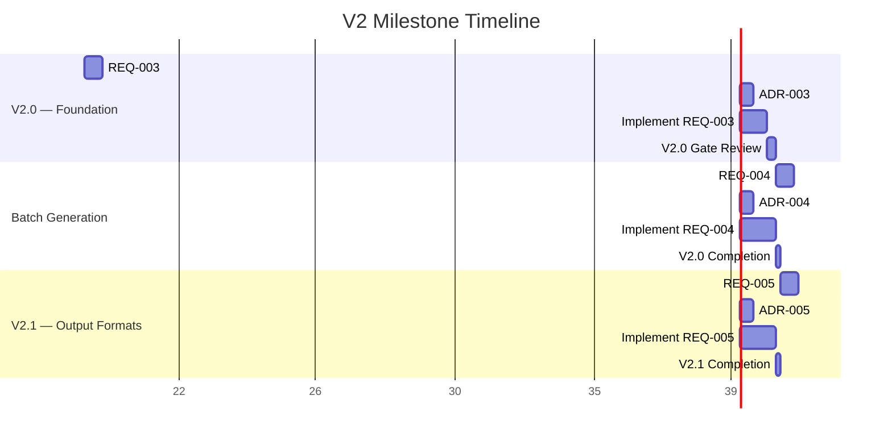
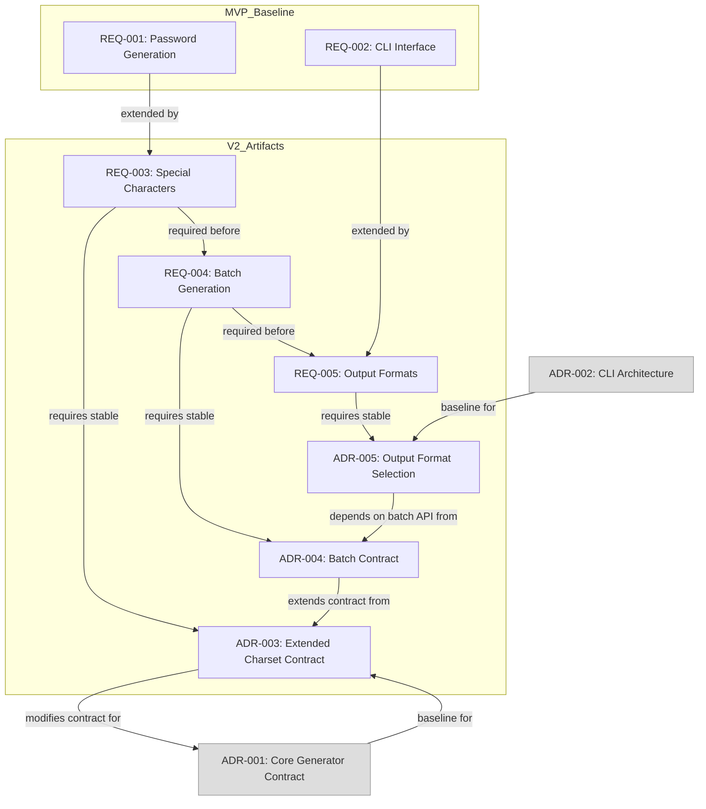

# CLI Password Generator — V2 Execution Plan

## 1. V2 Executive Summary

The CLI Password Generator MVP milestone is complete: REQ-001 (Password Generation Logic) and REQ-002 (CLI Interface Configuration) hold `implemented` status; ADR-001 (Core-Generator API Contract) and ADR-002 (CLI Interface Architecture) hold `accepted` status; and 24 of 24 pytest tests pass. The MVP delivers a cryptographic password generator with four alphanumeric character sets (`lower`, `upper`, `numeric`, `mixed`) behind a clean argparse-based CLI interface, separated across two services with strict boundary rules.

V2 is the next strategic milestone, expanding the tool into a production-grade utility with three core capabilities: **Batch Generation Mode** (`--batch N`), enabling users to produce multiple passwords in a single invocation; **Special Characters Set** (`special` charset), expanding the character space beyond alphanumeric to include punctuation and symbols for higher entropy passwords; and **Output Format Options** (`--format` flag supporting `json` and `csv`), enabling pipeline integration and scripted consumption of generated passwords. These three features complement each other: batch mode is most valuable when combined with structured output formats, and special characters raise the entropy ceiling that batch users benefit from.

The V2 plan is phased into two sub-milestones. **V2.0** (Foundation) delivers the special characters set and batch generation mode — both are self-contained extensions to existing capabilities requiring minimal cross-feature coordination. **V2.1** (Output Formats) introduces structured output, which depends on batch mode being functional and adds a new formatting layer to the cli-interface service. This sequencing minimizes integration risk and ensures each phase is independently shippable and verifiable.

---

## 2. Feature Prioritization Matrix

| Feature | Business Impact | Implementation Complexity | Effort (hours) | MoSCoW |
|---|---|---|---|---|
| Special Characters Set | High — directly increases password entropy ceiling; aligns with security best practices; fulfills the gap explicitly noted in REQ-001's Out of Scope | Low — additive change to existing character set logic in core-generator; extends the four-set model documented in ADR-001 Appendix B | 8 – 12 | Must |
| Batch Generation Mode (`--batch N`) | High — transforms the tool from a single-use utility into a bulk operations tool; enables password resets, account provisioning, and API key generation | Medium — requires new core-generator API surface (batch entry point) while preserving the single-password contract; cli-interface must manage iteration and accumulation | 12 – 16 | Must |
| Output Format Options (`--format json/csv`) | Medium — enables scripted consumption and pipeline integration; less critical for interactive terminal users but valuable for DevOps workflows | Medium-High — introduces a new formatting layer within cli-interface that must not leak into core-generator; requires structured data assembly before serialization | 16 – 20 | Should |

### Prioritization Rationale

1. **Special Characters Set first** because it has the lowest complexity-to-impact ratio and modifies only the core-generator's existing character set table. It establishes a stronger security baseline before batch mode multiplies output volume.
2. **Batch Generation Mode second** because it requires architectural decisions about how the core-generator exposes bulk operations without violating its pure-function, single-output invariant (REQ-F-005). This depends on the core-generator contract being stable, which the special characters set solidifies.
3. **Output Format Options last** because they naturally build on batch mode output — formatting a single password as JSON or CSV has limited value; formatting multiple passwords in structured output is the primary use case. This also keeps the V2.0 milestone focused on generation logic rather than presentation logic.

---

## 3. ADR Proposal Order

The V2 features require three new architecture decision records. Their proposal order is driven by dependency chains and boundary risk.

### ADR-003: Core-Generator Extended Character Set Contract

**Justification for first position:** This ADR must precede all other V2 ADRs because it directly modifies the core-generator API contract established in ADR-001. The `generate_password` function signature, character set mapping, and valid `charset` identifiers are the foundational surface that batch mode and output formats both depend on. If the character set table changes, the batch API must know what character sets to accept, and the output format must know what fields to serialize.

**Scope:** Extending the four-set model (`lower`, `upper`, `numeric`, `mixed`) to include a `special` charset and a `full` charset (combined alphanumeric plus special). Evaluating the special character inventory (which punctuation and symbols to include), ensuring uniform probability distribution remains achievable, and confirming the secrets module handles extended character ranges correctly.

**Service owner:** `core-generator`

### ADR-004: Core-Generator Batch Generation Contract

**Justification for second position:** This ADR depends on ADR-003 being resolved because the batch entry point must declare which character sets it supports. It cannot formalize the batch signature until the extended character set identifiers are known. Additionally, ADR-004 must be authored before ADR-005 because the output formatter (ADR-005 decision) must know whether it receives a single password string or a structured batch result.

**Scope:** Defining whether batch mode uses a new function (`generate_batch(n: int, ...) -> list[str]`) or whether the existing `generate_password` is invoked repeatedly from cli-interface. This decision directly impacts service boundary rules, test structure, and exception handling semantics.

**Service owner:** `core-generator` (with cross-concern implications for `cli-interface`)

### ADR-005: CLI Output Format Selection

**Justification for third position:** This ADR depends on both ADR-003 and ADR-004 because the output format layer must assemble data from the core-generator — whether single or batch — into structured representations. It can be evaluated and accepted only after the core-generator API surface is fully defined. Formatting is inherently a presentation concern scoped to cli-interface, so it carries no reverse dependencies.

**Scope:** Selecting which formats to support (`json`, `csv`), defining the serialization schema per format, and establishing whether format selection coexists with bare string output (the MVP default). Evaluating the trade-off between using Python's stdlib `json`/`csv` modules versus manual serialization.

**Service owner:** `cli-interface`

---

## 4. Effort Estimation per Feature

### REQ-003: Special Characters Set

| Activity | Estimated Hours | Notes |
|---|---|---|
| REQ authoring (functional + ACs) | 2 | Define the special character inventory, ACs for inclusion/exclusion, entropy validation |
| ADR-003 authoring and acceptance | 2 | Evaluate character set options, document consequences |
| Core-generator implementation | 4 | Extend character set table, validate uniform distribution, integration with existing logic |
| Test suite derivation from ACs | 4 | Coverage for special charset only, mixed-special combinations, exclusivity |
| **Subtotal** | **12** | |

### REQ-004: Batch Generation Mode

| Activity | Estimated Hours | Notes |
|---|---|---|
| REQ authoring (functional + ACs) | 2 | Define batch semantics, bounds, uniqueness guarantees |
| ADR-004 authoring and acceptance | 2 | Evaluate batch API patterns, document boundary implications |
| Core-generator batch implementation | 6 | New batch entry point, validation, uniqueness enforcement |
| CLI batch flag integration | 4 | `--batch N` flag, validation, iteration logic |
| Test suite derivation from ACs | 6 | Coverage for batch bounds, uniqueness, combined with all charsets |
| **Subtotal** | **20** | |

### REQ-005: Output Format Options

| Activity | Estimated Hours | Notes |
|---|---|---|
| REQ authoring (functional + ACs) | 2 | Define JSON/CSV schemas, schema compatibility |
| ADR-005 authoring and acceptance | 2 | Evaluate serialization approaches, format schema design |
| CLI formatter implementation | 8 | JSON assembly, CSV assembly, format dispatcher |
| Test suite derivation from ACs | 6 | Coverage for each format with single and batch output |
| **Subtotal** | **18** | |

### V2 Totals

| Scope | Total Estimated Hours |
|---|---|
| REQ authoring + ADR authoring | 10 |
| Implementation (core-generator + cli-interface) | 18 |
| Test suites | 16 |
| **Grand Total** | **50** |

---

## 5. Risk Assessment

### Risk 1: Service Boundary Violation — Batch Mode Logic Placement

**Likelihood:** Medium
**Impact:** High

Batch generation introduces the question of where iteration logic lives. Per AGENTS.md boundary rules, core-generator SHALL NOT depend on CLI libraries, and cli-interface SHALL NOT contain password generation logic. If the batch loop runs in the cli-interface, the cli-interface is orchestrating multiple calls to the core-generator — which is acceptable. If the batch loop runs in the core-generator as a new function, the core-generator must not absorb output accumulation or formatting concerns.

**Mitigation:** ADR-004 will explicitly decide whether the core-generator provides a batch entry point or whether the cli-interface handles iteration. Either choice is valid as long as pure-function semantics are preserved — individual password generation remains isolated, exception handling per attempt is explicit, and no terminal I/O leaks into core-generator.

### Risk 2: Character Set Expansion — Entropy Validation Completeness

**Likelihood:** Low
**Impact:** Medium

Adding special characters increases the character space, which changes entropy calculations. The MVP already validates that mixed mode with length >= 36 includes all character classes (REQ-001 AC-005). The V2 special charset must ensure that when combined with alphanumeric characters, the uniform distribution property holds and that no character class is systematically underrepresented.

**Mitigation:** REQ-003 will define explicit ACs validating character class inclusion for all new charset combinations. Test suites must include statistical distribution checks similar to AC-009 and AC-010 in REQ-001.

### Risk 3: Output Format Serialization — Schema Drift

**Likelihood:** Medium
**Impact:** Medium

JSON and CSV output introduce structured data contracts. If the core-generator API evolves between today and the time ADR-005 is implemented, the output schema may drift from what the formatter expects. This is particularly risky because V2.1 (output formats) is deliberately sequenced after V2.0 (batch + special charset).

**Mitigation:** ADR-005 will define stable serialization schemas that are versioned independently of the core-generator function signatures. The cli-interface will serve as the sole authority on output structure, assembling data from core-generator return values before serialization. This isolates schema changes to the cli-interface service.

### Risk 4: Test Coverage Regression — Cross-Feature Interaction

**Likelihood:** Medium
**Impact:** Medium

Combining batch mode with special characters and structured output produces a combinatorial explosion of test scenarios. Each charset (now six) multiplied by batch counts multiplied by output formats (now three: bare, json, csv) could produce hundreds of test cases if exhaustively covered.

**Mitigation:** REQ acceptance criteria will be written to cover representative scenarios, not combinatorial exhaustiveness. Equivalence class partitioning will be used: one test per charset per format per batch-bound (single, multi, max). This approach maintains coverage completeness while keeping test count manageable. Target: not more than 60 additional tests for V2 full scope.

### Risk 5: Stdlib Compliance — Third-Party Temptation

**Likelihood:** Low
**Impact:** Low

The project charter mandates stdlib-only usage (NFR-PT-001). Output formatting in particular tempts use of third-party libraries for CSV handling or JSON beautification.

**Mitigation:** ADR-005 must explicitly evaluate stdlib `json` and `csv` modules against alternatives and document that stdlib is sufficient. The architecture guidelines already flag this as a constraint — no ADR authoring this feature will overlook it.

---

## 6. Milestone Timeline

### Phase Descriptions

| Phase | Milestone Tag | Features Included | SDD Phases Active |
|---|---|---|---|
| **V2.0 — Foundation** | `v2` | Special Characters Set (REQ-003, ADR-003), Batch Generation Mode (REQ-004, ADR-004) | D2 (Specify) + D3 (Plan) + D4 (Implement) for both features |
| **V2.1 — Output Formats** | `v2` | Output Format Options (REQ-005, ADR-005) | D2 (Specify) + D3 (Plan) + D4 (Implement) |

### Gate Review Definition

The V2.0 Gate Review between the two feature groups is a deliberate checkpoint. All REQ-003 and ADR-003 artifacts must reach `accepted`/`implemented` status before REQ-004 authoring begins. This enforces the SDD phase gate rule: no document with `draft` status advances beyond its current phase. The gate ensures the core-generator contract is fully stabilized (special characters baked in) before the batch API is designed.

---

## 7. Quality Gates

### Pre-V2.0 Gate (before any V2.0 implementation begins)

| Gate | Requirement | Verification Method |
|---|---|---|
| REQ-003 complete | Status `accepted`, zero TBD/TO-DO markers, all ACs defined | Document review against guidelines.md §3 |
| ADR-003 complete | Status `accepted`, two or more options evaluated, consequences documented | Document review against ADR guidelines.md §2 |
| MVP baseline intact | All 24 MVP tests still passing on `main` branch | Test execution on main branch |

### Pre-V2.0-Complete Gate (before V2.0 is declared shippable)

| Gate | Requirement | Verification Method |
|---|---|---|
| REQ-003 + REQ-004 implemented | Both REQs at `implemented` status; all ACs satisfied by passing tests | Test results + status verification |
| ADR-003 + ADR-004 accepted | Both ADRs at `accepted` status | Status verification |
| Test suite completeness | All new ACs have corresponding pytest tests; total test count = 24 (MVP) + new AC-derived tests | Test discovery and execution |
| Service boundary compliance | Core-generator contains no CLI/terminal code; cli-interface contains no generation logic | Code review / static analysis |
| CI pipeline green | Lint (flake8/pylint), static type checking, and all tests passing on PR CI | CI pipeline results |

### Pre-V2.1-Complete Gate (before V2.1 is declared shippable)

| Gate | Requirement | Verification Method |
|---|---|---|
| REQ-005 implemented | Status `implemented`, all ACs satisfied | Test results + status verification |
| ADR-005 accepted | Status `accepted` | Status verification |
| Format output correctness | JSON is valid and parseable; CSV is well-formed per RFC 4180 | Automated serialization validation tests |
| Combinatorial coverage | Tests cover single-output JSON, single-output CSV, batch-output JSON, batch-output CSV, and bare output regression | Test matrix verification |
| Stdlib compliance | No new third-party dependencies introduced | Dependency audit |
| Full regression suite | All V2.0 + V2.1 tests passing; MVP tests still green | Full test suite execution |

---

## 8. Acceptance Strategy

### V2 Completion Criteria

V2 is considered complete when all of the following conditions hold simultaneously:

1. **All REQs in `implemented` status:** REQ-003 (Special Characters Set), REQ-004 (Batch Generation Mode), and REQ-005 (Output Format Options) must each hold `implemented` status with zero unresolved acceptance criteria.

2. **All ADRs in `accepted` status:** ADR-003 (Extended Character Set Contract), ADR-004 (Batch Generation Contract), and ADR-005 (CLI Output Format Selection) must each hold `accepted` status with zero TBD/TO-DO markers.

3. **Full test suite passing:** The combined test suite (MVP + V2) must pass with 100 percent success rate on the CI pipeline. The expected total test count is approximately 80–90 tests (24 MVP baseline plus 56–66 V2-derived tests), covering all acceptance criteria across all three domains.

4. **Service boundary integrity verified:** A final architectural review confirms that:
   - Core-generator contains zero references to argparse, sys.stdout, sys.stderr, or terminal I/O primitives.
   - Cli-interface contains zero character set definitions, password generation loops, or entropy calculation logic.
   - Cross-service calls flow exclusively from cli-interface to core-generator with no reverse dependency.

5. **Index files updated:** All three REQ index files (`index-cli-arguments.md`, `index-password-logic.md`, `index-security-validation.md`) and all three ADR index files (`index-cli-interface.md`, `index-core-generator.md`) must reflect the V2 REQ and ADR entries. No V2 artifact may exist without a corresponding index entry.

6. **Help text and error message parity:** The cli-interface help text must document all new flags (`--batch`, `--format`, extended `--charset` choices) and their defaults. All new exception types from the extended core-generator contract must have user-friendly error message mappings.

### Measuring Success

| Metric | MVP Baseline | V2 Target | Measurement |
|---|---|---|---|
| Acceptable charsets | 4 | 6 (lower, upper, numeric, mixed, special, full) | Core-generator character set registry |
| Max output per invocation | 1 password | N passwords (1 <= N <= 128) | Batch generation test scenarios |
| Output formats | 1 (bare string) | 3 (bare, JSON, CSV) | Format dispatcher test coverage |
| Test count | 24 | 80 – 90 | pytest collection results |
| ADR coverage | 2 | 5 | ADR index file entries |
| Service boundary violations | 0 | 0 | Architectural review + static analysis |

### V2 Completion Declaration Process

The milestone owner (Architect role) SHALL issue a V2 completion declaration when all six criteria above hold. The declaration takes the form of updating each completed REQ's status from `implemented` to `delivered` in sequence, starting with REQ-003, then REQ-004, then REQ-005. The delivery order is intentional: lower-level changes (character sets) are declared delivered before higher-level composite features (batch, formats) that depend on them.

---

## 9. Dependency Summary

**Critical path:** R003 → ADR-003 → R004 → ADR-004 → R005 → ADR-005

Each arrow represents a mandatory sequencing constraint. No downstream artifact may begin its D2 (Specify) phase until its upstream dependency completes its D3 (Plan) phase and reaches `accepted` status.
