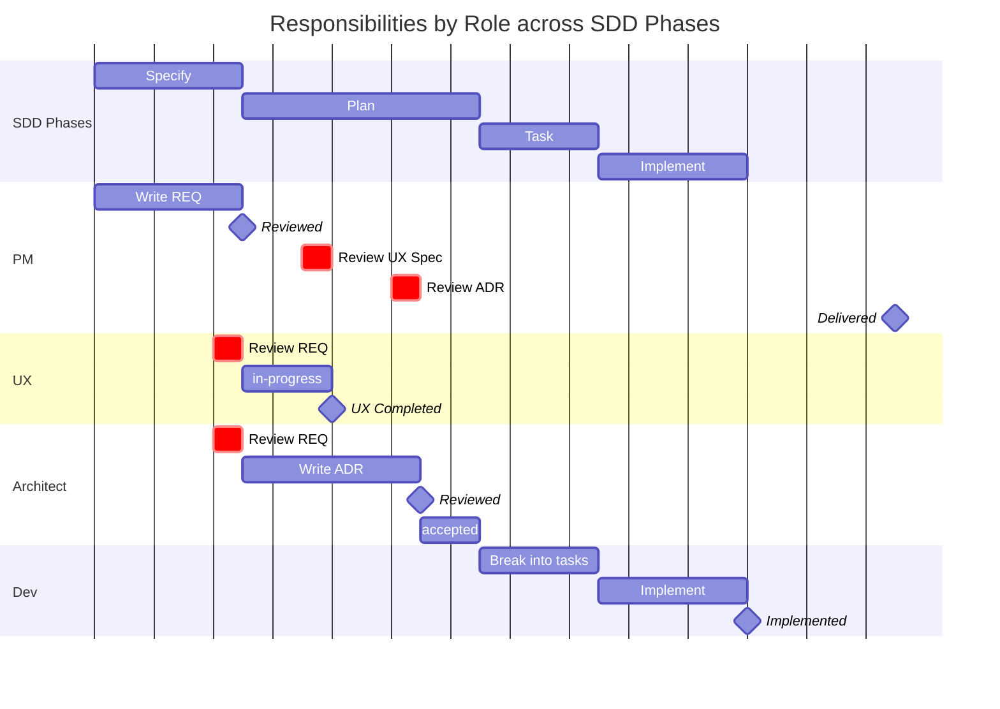

# How We Build: Methodology and Vocabulary

> How specifications, architecture decisions, and implementation fit together in this project.

Without a shared process, specifications become decoration — written once, ignored when coding starts. This project uses **Spec Driven Development (SDD)**: the specification is the authoritative source of truth, and implementation only begins when the spec is stable and approved. The payoff is straightforward — code written against an approved spec requires far less rework than code written against a moving target.

The vocabulary here is drawn from six frameworks:

| Framework | Problem it solves |
|-----------|------------------|
| **IREB** | Requirements written without precise language are unverifiable. IREB provides obligation keywords (`SHALL`, `SHOULD`, `MAY`) and testable acceptance criteria so every requirement can be confirmed as done or not done. |
| **ISO 25010** | Non-functional requirements written as adjectives ("fast", "secure") cannot be tested. ISO 25010 provides a controlled vocabulary for quality attributes so every NFR has a measurable target. |
| **ATAM** | Architecture decisions without explicit tradeoffs look better than they are. ATAM provides a vocabulary for consequences (Tradeoff, Sensitivity, Risk) so decisions are honest about their costs. |
| **RM-ODP** | Architecture decisions that mix interface, infrastructure, and technology concerns in the same document are hard to reason about. RM-ODP viewpoints (Computational, Engineering, Technology) provide a language to identify which layer a decision affects. |
| **MADR** | ADRs without a consistent structure are hard to navigate and compare. MADR provides the base format: Considered Options, Decision Outcome, Consequences. |
| **BDD / TDD** | Code without tests has no definition of done. BDD maps Given/When/Then ACs directly to executable tests. TDD ensures tests exist before code — making every AC a verifiable specification. |

You don't need to read any of these frameworks to use this document. The tables below are sufficient.

---

## Spec Driven Development

### Lifecycle

```
Specify → Plan → Task → Implement
```

| Phase | What happens | Artifacts | Gate to advance | Who clears the gate |
|-------|-------------|-----------|-----------------|---------------------|
| **Specify** | Problem, functional requirements, and acceptance criteria written as a REQ | REQ file in `requirements/` | REQ reaches `status: accepted` | PM / Product Owner |
| **Plan** | Architecture decisions that govern the REQ written as ADRs | ADR files in `architecture/adrs/` | All `related-adrs` reach `status: accepted` — or Architect confirms no ADRs are needed | Architect |
| **Task** | REQ decomposed into GitHub Issues; issues estimated | Issues in tracker | Issues created, estimated, linked to tracking issue | Dev Team |
| **Implement** | Tests derived from REQ ACs written first (TDD/BDD). Code written, reviewed, merged, released. No PR is mergeable without passing tests covering every AC. | Pull Requests | PR merged → `status: implemented`; production deploy → `status: delivered` | Developer / PM |

> **Blocking rule:** A REQ with `status: accepted` where any entry in `related-adrs` is still `status: proposed` is blocked at Plan. Do not move to Task or Implement until the Architect clears the gate.

> **Blocking rule (Implement):** A PR SHALL NOT be merged without tests that map to the REQ's ACs. AC → test → code is the verification mechanism of SDD. Code without tests has no definition of done.

> **Tracking:** Phase progress from Task onward is tracked in GitHub Issues, not in document status. See [`workflows/issue-tracking.md`](workflows/issue-tracking.md) for the full guide.

---

## Document Status Lifecycles

The diagrams and tables below show how REQ and ADR statuses map to SDD phases. Each status exists only while its phase is active — it does not persist indefinitely.

> **Deprecated:** This diagram reflects the design-first paradigm (REQ → UX Spec → ADRs → implement) superseded on 2026-04-27. The implementation-first approach is now in effect. This chart will be redrawn in a future PR.



### REQ Status Lifecycle

| Status | Who sets it | When | TBD allowed? |
|--------|-------------|------|--------------|
| `draft` | PM / Author | Being written or under review. MAY be merged as `draft`. | Yes |
| `accepted` | PM / Product Owner | Approved for implementation. ACs complete, zero TBDs. | No — hard blocker |
| `implemented` | Developer | Implementing PR merged and tests passing. Milestone not yet in production. | No — hard blocker |
| `delivered` | PM | Milestone in production. Feature live for users. | No — hard blocker |
| `cancelled` | PM | Will not be implemented. Never delete — add a note at the top explaining why. | — |
| `superseded` | PM | Replaced by another REQ. Never delete — add `> Superseded by [REQ-NNN](file.md).` at top. | — |

> Full authoring rules: [REQ Authoring Guidelines](requirements/guidelines.md#3-status-lifecycle)

### ADR Status Lifecycle

| Status | Who sets it | When | TBD allowed? |
|--------|-------------|------|--------------|
| `proposed` | Architect | Under review. MAY be merged as `proposed` — iteration before acceptance is expected. | Yes |
| `accepted` | Architect | Decision approved and stable. Zero TBDs. For major reversals, create a new ADR. | No — hard blocker |
| `deprecated` | Architect | Decision no longer relevant. Never delete — add `> Deprecated: [reason].` at top. | — |
| `superseded by ADR-NNN` | Architect | Replaced by a newer ADR. Never delete — add `> Superseded by [ADR-NNN](file.md).` at top. | — |

> Full authoring rules: [ADR Authoring Guidelines](architecture/adrs/guidelines.md#3-status-lifecycle)

---

## How to Evaluate AI-Generated Content

Three questions per artefact. If all three pass, the document is likely sound.

### REQs

1. **Does every `SHALL` have at least one AC that tests it?**
   If a functional requirement has no acceptance criterion, it cannot be verified — and the implementation has no definition of done.

2. **Does the Problem Statement name a real stakeholder and a concrete consequence of not solving the problem?**
   Generic problem statements ("users need a better experience") hide unvalidated assumptions. A specific stakeholder and a specific cost of inaction are non-negotiable.

3. **Do the NFRs contain concrete numbers with measurement conditions — not adjectives?**
   "The system shall be fast" is not a requirement. "Time Behaviour — p95 < 1s for 200 signals on standard hardware" is.

### ADRs

1. **Is there at least one `Bad, because` entry with an explicit mitigation or acceptance statement?**
   Every architectural decision has a cost. An ADR with only `Good, because` entries has not been honestly evaluated.

2. **Are at least two options listed in Considered Options — not just the chosen one?**
   A decision without alternatives documented is not a decision record — it is an announcement. The rejected options and their reasons are the most valuable part of an ADR.

3. **Can the decision be understood without reading the code?**
   An ADR that requires reading the implementation to understand the choice has failed its purpose. Context and consequences must be self-contained.

---

## REQ Vocabulary

### Obligation keywords (IREB / RFC 2119)

Every functional requirement uses one of these keywords. Always capitalised.

> Authoring rules for obligation keywords are in [REQ Authoring Guidelines](requirements/guidelines.md#41-rfc-2119-keywords).

| Keyword | Meaning | Use when |
|---------|---------|----------|
| `SHALL` | Mandatory — the system must do this | Core behaviour, no exceptions |
| `SHALL NOT` | Prohibited — the system must never do this | Hard constraints |
| `SHOULD` | Recommended — omission requires justification | Best practice with acknowledged exceptions |
| `MAY` | Optional — implementer's discretion | Permitted but not required |

> Lowercase `must`, `should`, `may` are ambiguous — do not use them in functional requirements.

### Problem Statement elements

A well-formed Problem Statement answers all four of these:

> Authoring rules for the Problem Statement section are in [REQ Authoring Guidelines](requirements/guidelines.md#21-required-sections-and-order).

| Element | Question it answers | Example |
|---------|--------------------|---------| 
| **Stakeholder** | Who has the problem? | "Signal Curators evaluating large reports…" |
| **Problem** | What is the observable pain? | "…cannot perceive thematic relationships that span categories." |
| **Evidence** | Why do we know this is real? | Observation, data, user feedback |
| **If unsolved** | What is the cost of inaction? | "Curators spend disproportionate time on sequential evaluation…" |

Policy constraints (what the system SHALL NOT do as part of the solution) belong in the Problem Statement, not scattered across functional requirements.

### NFR Quality Attributes (ISO 25010)

Every Non-Functional Requirement SHALL name the ISO 25010 subcategory it constrains. Use the subcategory name directly in the NFR table — the full taxonomy is in the Appendix.

> Naming the subcategory is **mandatory when an NFR is written**. The NFR section itself is **optional** — omit it entirely if a REQ has no quality constraints. Authoring rules and the NFR table format are in [REQ Authoring Guidelines](requirements/guidelines.md#25-non-functional-requirements).

---

## ADR Vocabulary

### Consequence prefixes (ATAM)

ADR consequences use these prefixes. The first three (`Good`, `Bad`, `Neutral`) are from MADR and are **mandatory** in every ADR. The last two (`Tradeoff`, `Sensitivity`) are ATAM extensions — **optional**, use only when a quality attribute tradeoff is explicit. Reviewers MUST NOT flag their absence.

> Authoring rules for Consequences are in [ADR Authoring Guidelines](architecture/adrs/guidelines.md#24-consequences-format).

| Prefix | When to use |
|--------|-------------|
| `Good, because` | Positive outcome of the decision |
| `Bad, because … — mitigated/acceptable: …` | Cost or trade-off — mitigation is mandatory |
| `Neutral, because` | Neither good nor bad, but worth noting |
| `Tradeoff, because [attribute A] ↑ at the cost of [attribute B] ↓` | When the decision improves one ISO 25010 quality at the explicit expense of another |
| `Sensitivity, because` | When a small change to this decision would have a disproportionate impact on a quality attribute |

### Quality Attribute Driver *(optional)*

When an ADR is motivated by a quality concern, the `## Context and Problem Statement` SHOULD identify which ISO 25010 subcategory is at stake and the scenario that made it relevant.

Example:
> **Quality driver:** Resource Utilisation — the graph rendering library will be lazy-loaded. Bundle size is a hard constraint: a library exceeding 150KB gzipped would violate NFR-006.

### RM-ODP viewpoints *(optional — applied selectively)*

When an ADR decision affects a specific architectural layer, name which layer in the Context — plain prose, not a field. Layers not affected by the decision are simply omitted. Omitting viewpoints is correct and expected when the decision does not have architectural layer implications.

| Viewpoint | What it covers | Example |
|-----------|---------------|---------|
| **Computational** | Component interfaces, contracts, object interactions | "This decision changes the interface between the curation state store and the graph renderer." |
| **Engineering** | Distribution mechanisms, session management, infrastructure | "This decision affects how grouping data is cached between ingestion and the client." |
| **Technology** | Concrete library or platform choices | "This is a technology choice between React Flow and Cytoscape.js." |

---

## See also

- [REQ Authoring Guidelines](requirements/guidelines.md) — how to write requirements
- [ADR Authoring Guidelines](architecture/adrs/guidelines.md) — how to write architecture decisions
- [Issue Tracking Workflow](workflows/issue-tracking.md) — how to track SDD phases in GitHub Issues

---

## Appendix: ISO 25010 and Framework Provenance

### ISO 25010 full taxonomy

| Characteristic | Subcategories |
|---------------|---------------|
| **Functional Suitability** | Functional Completeness, Functional Correctness, Functional Appropriateness |
| **Performance Efficiency** | Time Behaviour, Resource Utilisation, Capacity |
| **Compatibility** | Co-existence, Interoperability |
| **Usability** | Appropriateness Recognizability, Learnability, Operability, User Error Protection, User Interface Aesthetics, Accessibility |
| **Reliability** | Maturity, Availability, Fault Tolerance, Recoverability |
| **Security** | Confidentiality, Integrity, Non-repudiation, Accountability, Authenticity |
| **Maintainability** | Modularity, Reusability, Analysability, Modifiability, Testability |
| **Portability** | Adaptability, Installability, Replaceability |

### Framework provenance

The vocabulary in this document is drawn from the following standards. The tables above are sufficient for daily use — read the sources if you want the full specification.

| Framework | What we use from it | Reference |
|-----------|--------------------|-----------| 
| **IREB / CPRE** | RFC 2119 obligation keywords, stable IDs, Given/When/Then acceptance criteria, MoSCoW priority | [ireb.org](https://www.ireb.org) |
| **ISO/IEC 25010 (SQuaRE)** | Quality attribute taxonomy for NFRs | [iso.org/standard/35733](https://www.iso.org/standard/35733.html) |
| **ATAM** (SEI / Carnegie Mellon) | Consequence prefixes (Tradeoff, Sensitivity), Quality Attribute Driver concept | [SEI Technical Report](https://resources.sei.cmu.edu/library/asset-view.cfm?assetid=513908) |
| **RM-ODP** (ISO/IEC 10746) | Computational / Engineering / Technology viewpoints for ADR context | [iso.org/standard/20696](https://www.iso.org/standard/20696.html) |
| **MADR 4.0** | ADR base format: Considered Options, Decision Outcome, Consequences | [adr.github.io/madr](https://adr.github.io/madr/) |
| **SDD** | Spec Driven Development methodology | [Wikipedia](https://en.wikipedia.org/wiki/Spec-driven_development) · [Kinde](https://www.kinde.com/learn/ai-for-software-engineering/best-practice/beyond-tdd-why-spec-driven-development-is-the-next-step/) |